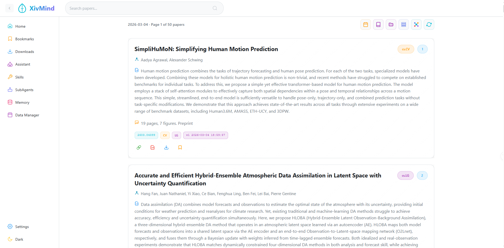

<div align="center">
<a href="https://github.com/uwjia/XivMind/">

</a>
</div>

<div align="center" style="margin-top:20px;margin-bottom:20px;">

</div>

# XivMind

由 AI 构建，由人类驱动。arXiv 的智慧大脑。

[English](README.md) | **中文**

一款现代化的 arXiv 论文管理应用，具备收藏、下载和 AI 助手功能。

## 功能特性

- 📚 卡片式论文浏览
- 🔍 按分类和日期进行高级搜索和筛选
- 🔖 收藏论文以便后续阅读
- 📥 下载 PDF 并跟踪进度
- 🕸️ 知识图谱可视化
  - 发现论文之间的关系
  - 识别研究聚类和趋势
  - 多种布局选项：力导向、圆形、层级
  - 交互式节点探索，支持相似度过滤
- 🤖 AI 助手解答论文相关问题
  - 多种 LLM 提供商：OpenAI、Anthropic、GLM（智谱 AI）、Ollama（本地）
  - 论文语义搜索
  - 基于论文库的问答
  - 动态技能系统，支持自定义任务
- 🤖 SubAgents - 用于复杂研究任务的 AI 代理
  - 研究助手：文献搜索和分析
  - 分析助手：深度论文分析和比较
  - 写作助手：学术写作支持
  - 动态代理创建，支持自定义工具和技能
- 🧠 长记忆系统，提供个性化 AI 体验
  - 核心记忆：用户画像，包含研究兴趣和偏好设置
  - 对话记忆：对话历史的语义搜索
  - 知识库记忆：笔记和见解的长期存储
- 👥 Team - 多智能体协作系统
  - 自动任务复杂度分析
  - 智能任务分解为子任务
  - 智能体自动选择（研究、分析、写作智能体）
  - 并行执行提升效率
  - 多智能体结果综合
- 🔀 Workflow - 可视化工作流编辑和执行系统
  - 拖拽式节点编辑器
  - 多种节点类型：输入、分析、分解、智能体、条件、并行、综合、输出、工具、技能
  - 预置模板：快速摘要、论文分析、多智能体协作、自适应工作流
  - 实时执行监控
  - JSON 格式导入/导出工作流
- 🌙 深色/浅色主题切换
- 📱 响应式设计
- 🎨 现代化 UI，流畅动画

## 技术栈

### 前端
- **Vue 3** - 渐进式 JavaScript 框架
- **Vite** - 下一代前端构建工具
- **Vue Router** - Vue.js 官方路由
- **Pinia** - 状态管理库
- **TypeScript** - 类型安全的 JavaScript
- **Markdown-it** - 支持 LaTeX 的 Markdown 渲染
- **Storybook** - 组件开发和文档

### 后端
- **FastAPI** - 现代 Python Web 框架
- **SQLite** - 轻量级数据库（默认，无需 Docker）
- **LanceDB** - 嵌入式向量数据库（推荐用于需要向量搜索的开发场景）
- **Milvus** - 向量数据库（可选，用于生产环境）
- **WebSocket** - 实时下载进度更新

## 快速开始

### 环境要求

#### SQLite 模式（基础开发）
- Node.js 18+
- Python 3.10+
- 无需 Docker

#### LanceDB 模式（带向量搜索的开发）
- Node.js 18+
- Python 3.10+
- 无需 Docker
- 无需服务器即可支持向量搜索

#### Milvus 模式（推荐用于生产）
- Node.js 18+
- Python 3.10+
- Docker & Docker Compose

### 方式一：SQLite 模式（无需 Docker）

SQLite 模式非常适合开发、测试或独立使用。

**1. 配置后端**

```bash
cd backend
cp .env.example .env
```

编辑 `.env` 文件：

```env
DATABASE_TYPE=sqlite
SQLITE_DB_PATH=./data/xivmind.db
DOWNLOAD_DIR=./downloads
```

**2. 启动后端服务**

**Windows:**
```cmd
start.bat install         # 仅首次运行
start.bat dev             # 开发模式
```

**Linux/Mac:**
```bash
./start.sh install        # 仅首次运行
./start.sh dev            # 开发模式
```

**3. 启动前端**

```bash
npm install
npm run dev
```

### 方式二：LanceDB 模式（无需 Docker，支持向量搜索）

LanceDB 模式提供向量搜索能力，无需单独服务器。非常适合需要 AI 功能的开发场景。

**1. 配置后端**

```bash
cd backend
cp .env.example .env
```

编辑 `.env` 文件：

```env
DATABASE_TYPE=lancedb
LANCEDB_PATH=./data/lancedb
DOWNLOAD_DIR=./downloads
```

**2. 启动后端服务**

**Windows:**
```cmd
start.bat install         # 仅首次运行
start.bat dev             # 开发模式
```

**Linux/Mac:**
```bash
./start.sh install        # 仅首次运行
./start.sh dev            # 开发模式
```

**3. 启动前端**

```bash
npm install
npm run dev
```

### 方式三：Milvus 模式（生产环境）

Milvus 模式提供更好的可扩展性和向量搜索能力。

**1. 启动 Milvus 数据库**

```bash
cd backend/docker
docker-compose -f compose/milvus.yml up -d      # 完整模式 (etcd + minio + standalone + attu)
docker-compose -f compose/milvus.lite.yml up -d # 轻量模式（嵌入式，内存占用更少）
```

**2. 配置并启动后端**

```bash
cd backend
cp .env.example .env
```

编辑 `.env` 文件：

```env
DATABASE_TYPE=milvus
MILVUS_HOST=localhost
MILVUS_PORT=19530
DATABASE_NAME=xivmind
DOWNLOAD_DIR=./downloads
```

**Windows:**
```cmd
start.bat install         # 仅首次运行
start.bat start           # 启动服务
```

**Linux/Mac:**
```bash
./start.sh install        # 仅首次运行
./start.sh start          # 启动服务
```

**3. 启动前端**

```bash
npm install
npm run dev
```

应用将在 `http://localhost:5173` 可用

### 方式四：Docker 部署

将 XivMind 部署为 Docker 容器，适用于生产环境或隔离环境。

**CPU 版本（LanceDB）：**
```bash
cd backend/docker
docker-compose -f compose/xivmind.yml up -d
```

**GPU 版本（CUDA 12.8）：**
```bash
cd backend/docker
docker-compose -f compose/xivmind.gpu.yml up -d
```

**配置说明：**
- 复制 `.env.example` 为 `.env` 并配置您的设置
- 如果未提供 `.env` 文件，容器会自动从示例创建
- 数据和模型存储在 Docker 命名卷中

**访问地址：** http://localhost:8000

更多详情请参阅 [backend/docker/README.md](backend/docker/README.md)。

## 后端脚本

### start.bat / start.sh 命令

| 命令 | 描述 |
|------|------|
| `start` | 启动后端服务（后台运行） |
| `stop` | 停止后端服务 |
| `install` | 创建虚拟环境并安装依赖（删除现有虚拟环境前会提示确认） |
| `update` | 更新依赖（不重新创建虚拟环境） |
| `dev` | 开发模式启动（前台运行，自动重载） |

**Windows:**
```cmd
start.bat install    # 首次安装
start.bat update     # 更新依赖
start.bat dev        # 开发模式
start.bat start      # 后台服务
start.bat stop       # 停止服务
```

**Linux/Mac:**
```bash
./start.sh install   # 首次安装
./start.sh update    # 更新依赖
./start.sh dev       # 开发模式
./start.sh start     # 后台服务
./start.sh stop      # 停止服务
./start.sh logs      # 查看日志
./start.sh status    # 查看服务状态
```

### GPU 支持（本地 PyTorch 安装）

如果您已下载 PyTorch wheel 文件用于 GPU 支持，可使用本地安装脚本：

**前置条件：**
1. 从 https://download.pytorch.org/whl/cu128/ 下载 PyTorch wheels
   - `torch-2.8.0+cu128-cp312-cp312-win_amd64.whl`
   - `torchvision-0.23.0+cu128-cp312-cp312-win_amd64.whl`
2. 先运行 `start.bat install` 创建虚拟环境

**Windows:**
```cmd
install_local_pytorch.bat
```

**Linux/Mac:**
```bash
chmod +x install_local_pytorch.sh
./install_local_pytorch.sh
```

**验证 GPU 支持：**
```bash
python -c "import torch; print('CUDA available:', torch.cuda.is_available())"
```

### GPU 支持（在线安装）

或者，您可以使用 `requirements-gpu.txt` 在线安装 GPU 依赖：

**Windows:**
```cmd
start.bat install
venv\Scripts\activate
pip install -r requirements-gpu.txt
```

**Linux/Mac:**
```bash
./start.sh install
source venv/bin/activate
pip install -r requirements-gpu.txt
```

**验证 GPU 支持：**
```bash
python -c "import torch; print('CUDA available:', torch.cuda.is_available())"
```

## AI 助手配置

AI 助手支持多种 LLM 提供商。可在**设置**页面或 `.env` 文件中配置：

### OpenAI

```env
LLM_PROVIDER=openai
LLM_MODEL=gpt-4o-mini
OPENAI_API_KEY=your-api-key
```

### Anthropic

```env
LLM_PROVIDER=anthropic
LLM_MODEL=claude-3-haiku-20240307
ANTHROPIC_API_KEY=your-api-key
```

### GLM（智谱 AI）

```env
LLM_PROVIDER=glm
LLM_MODEL=glm-4-plus
GLM_API_KEY=your-zhipu-api-key
GLM_BASE_URL=https://open.bigmodel.cn/api/paas/v4
```

从以下地址获取 API Key：https://open.bigmodel.cn

### Ollama（本地 LLM）

```env
LLM_PROVIDER=ollama
OLLAMA_BASE_URL=http://localhost:11434
OLLAMA_MODEL=llama3
```

从以下地址安装 Ollama：https://ollama.ai

```bash
# 安装模型
ollama pull llama3
ollama pull mistral
ollama pull qwen2
```

## 数据库对比

| 特性 | SQLite | LanceDB | Milvus | Docker |
|------|--------|---------|--------|--------|
| 安装 | 无需安装 | 无需安装 | 需要 Docker | 需要 Docker |
| 内存 | 极少 | 极少 | ~1-2GB | ~8-9GB 镜像 |
| 向量搜索 | 不支持 | 支持 | 支持 | 支持 |
| 可扩展性 | 单机 | 单机 | 分布式 | 容器化 |
| 需要服务器 | 否 | 否 | 是 | 是 |
| 使用场景 | 基础开发 | 带 AI 功能的开发 | 生产环境 | 生产环境 / 隔离环境 |

## 服务地址

| 服务 | 地址 | 说明 |
|------|------|------|
| 前端 | http://localhost:5173 | Vue 应用 |
| API 文档 | http://localhost:8000/docs | Swagger UI |
| API 文档 | http://localhost:8000/redoc | ReDoc |
| Attu | http://localhost:3000 | Milvus 管理界面（仅 Milvus 模式） |
| Storybook | http://localhost:6006 | 组件文档 |

## 功能概览

### 首页
- arXiv 最新论文
- 分类和日期筛选
- 论文卡片，支持收藏/下载操作
- 详细/简洁卡片视图切换
- 知识图谱视图，可视化论文关系

### 知识图谱
- 基于语义相似度可视化论文关系
- 识别研究聚类和热门主题
- 交互式探索，点击节点查看详情
- 可调节相似度阈值过滤边
- 多种布局算法：力导向、圆形、层级
- 基于分类的过滤和节点着色
- 统计面板显示论文总数、连接数和热门分类

### 论文详情页
- 完整论文信息，支持 LaTeX 渲染
- 收藏和下载操作
- 下载状态指示器
- 相关论文推荐

### 收藏页
- 查看所有收藏的论文
- 在收藏中搜索
- 下载或移除收藏
- 下载状态指示器

### 下载页
- 查看所有下载任务
- 通过 WebSocket 实时跟踪进度
- 打开已下载文件
- 重试失败的下载

### AI 助手页
- **搜索模式**：在论文库中进行语义搜索
- **提问模式**：基于论文内容回答问题
- **技能模式**：对论文执行特定任务
  - 内置技能：论文摘要、翻译、引用生成、相关论文
  - 动态技能：从 SKILL.md 文件加载的自定义技能
  - 创建自己的技能，支持自定义提示词
- 各模式独立保存消息历史
- 复制和重试功能
- 支持多种 LLM 提供商，可在设置中轻松切换

### SubAgents 页面
- **研究助手**：文献搜索和研究分析
  - 使用语义搜索搜索论文
  - 获取详细论文信息
  - 对论文执行技能分析
- **分析助手**：深度分析和比较研究
  - 论文方法论分析
  - 结果评估和趋势发现
- **写作助手**：学术写作支持
  - 文献综述写作
  - 摘要生成
  - 翻译和润色
- **动态代理**：通过 AGENT.md 文件创建自定义代理
- **工具系统**：内置工具用于论文操作
  - `search_papers`：语义论文搜索
  - `get_paper_details`：获取论文信息
  - `execute_skill`：对论文执行技能

### 设置页
- 主题配置（深色/浅色）
- LLM 提供商配置
  - 选择提供商和模型
  - 配置 API Key
  - 测试连接状态
- 应用偏好设置

### 数据管理页
- 年度日历视图，按月概览
- 月度详细视图，按日统计
- 统计面板，显示总存储天数、论文数和年度分布
- 从 arXiv 获取特定日期的论文
- 清除特定日期的缓存
- 可视化状态指示器（已存储、获取中、无论文、未来日期）
- 点击已存储日期跳转到论文列表

## 技能系统

XivMind 具有强大的技能系统，允许您对论文执行各种任务。

### 内置技能
- **论文摘要**：生成简洁摘要，突出关键贡献
- **论文翻译**：将论文内容翻译为多种语言（中文、日语、德语、法语、西班牙语）
- **引用生成**：生成 APA、MLA、BibTeX、IEEE 格式的引用
- **相关论文**：在论文库中查找相似论文

### 动态技能
通过在 `backend/skills/` 目录中添加 `SKILL.md` 文件来创建自定义技能：

```markdown
---
name: my-custom-skill
description: 我的自定义技能描述
icon: file-text
category: analysis
requires_paper: true
metadata:
  xivmind:
    input_schema:
      type: object
      properties:
        param1:
          type: string
          description: 参数描述
          default: "默认值"
---

# 我的自定义技能

在这里编写提示词模板，使用 {paper.title} 和 {paper.abstract} 占位符。
```

## SubAgents 系统

XivMind 具有动态 SubAgents 系统，允许 AI 代理使用工具和技能执行复杂的研究任务。

### 内置 SubAgents
- **研究助手**：文献搜索和研究分析
  - 使用语义搜索搜索论文
  - 获取论文详情
  - 执行技能分析
- **分析助手**：深度分析和比较研究
  - 论文方法论分析
  - 结果评估
  - 趋势发现
- **写作助手**：学术写作支持
  - 文献综述写作
  - 摘要生成
  - 翻译和润色

### 动态 SubAgents
通过在 `backend/subagents/` 目录中添加 `AGENT.md` 文件来创建自定义代理：

```markdown
---
id: my-agent
name: 我的自定义代理
description: 我的自定义代理描述
icon: search
skills:
  - summary
  - citation
tools:
  - search_papers
  - get_paper_details
  - execute_skill
max_turns: 15
temperature: 0.3
model: gpt-4o-mini
---

# 我的自定义代理

你是一个专业的助手，专门...

## 工具调用格式

使用工具时，使用以下格式
[TOOL: tool_name({"arg1": "value1"})]

## 可用工具

- search_papers: 搜索论文
- get_paper_details: 获取论文详情
- execute_skill: 执行技能分析
```

### 工具系统
SubAgents 可以使用以下内置工具：

| 工具 | 描述 | 参数 |
|------|------|------|
| `search_papers` | 使用语义搜索搜索论文 | `query`, `top_k` |
| `get_paper_details` | 获取详细论文信息 | `paper_id` |
| `execute_skill` | 对论文执行技能 | `skill_id`, `paper_ids` |

### 全局 LLM 集成
SubAgents 使用在设置页面配置的全局 LLM 设置。这确保了所有功能之间 AI 行为的一致性。

完整 API 文档请参阅 [backend/README_CN.md](backend/README_CN.md#api-接口)。

## 开发

### 前端

```bash
npm run dev          # 开发服务器
npm run build        # 生产构建
npm run preview      # 预览生产构建
npm run storybook    # 组件开发
```

### 后端

```bash
cd backend
start.bat dev        # Windows - 开发模式
./start.sh dev       # Linux/Mac - 开发模式
```

## 组件开发

XivMind 使用 Storybook 进行组件开发和文档：

```bash
npm run storybook
```

访问地址：http://localhost:6006

可用的组件类别：
- **PaperCard** - 论文展示组件
- **Graph** - KnowledgeGraph、GraphControls、GraphLegend、GraphStatistics 组件
- **Skills** - SkillCard、SkillForm 组件
- **UI 组件** - 按钮、对话框、工具提示等

## 数据库模式升级

参见 [backend/SCHEMA_UPGRADE.md](backend/SCHEMA_UPGRADE.md) 了解数据库模式升级说明。

## 许可证

MIT
